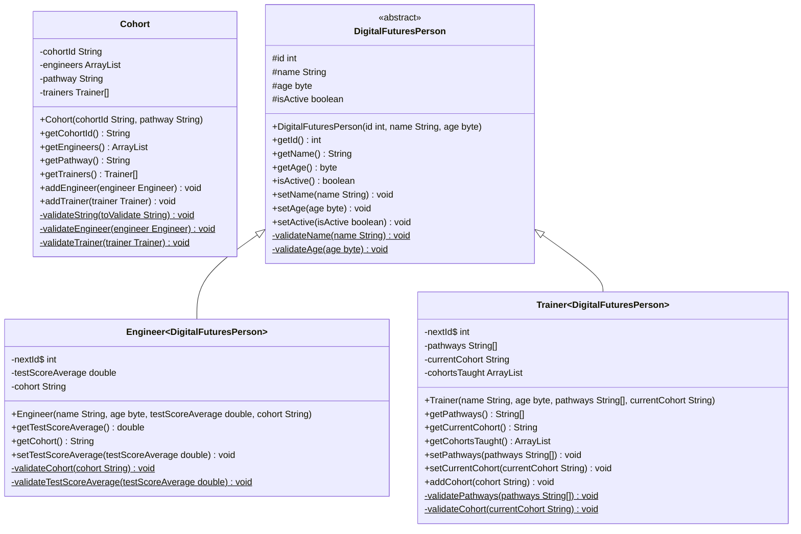

# Session 5 - Using Classes and Mocking in Tests

In this session, we will complete the following tasks:

- [Session 5 - Using Classes and Mocking in Tests](#session-5---using-classes-and-mocking-in-tests)
  - [1. Using Classes in other Classes and Class Diagrams](#1-using-classes-in-other-classes-and-class-diagrams)
  - [2. Loosely-Coupled Classes and Tests](#2-loosely-coupled-classes-and-tests)
  - [3. Adding Mocking Capability to Tests](#3-adding-mocking-capability-to-tests)
  - [4. Using Mocks in Tests](#4-using-mocks-in-tests)
  - [Notes](#notes)

---

## 1. Using Classes in other Classes and Class Diagrams

So far we have the capability to create individual instances of the `Engineer` and `Trainer` classes.  
The way _**Digital Futures**_ wants to use these classes would be to create some form of collection of `Engineer` and `Trainer` objects.
This would form the basis of a **Cohort**.  A `Cohort` instance would have an `id`, a `pathway`, a collection of `Engineer` objects and
record of the `Trainer`s assigned to the cohort.

The specification for the `Cohort` class is as follows:

- **Class Members:**
  - `int id`
  - `String pathway`
  - `ArrayList<Engineer> engineers`
  - `Trainer[] trainers`
- **Constructors:**
  - A parameterized constructor that takes `String` values for `id` and `pathway` (both of which must not be empty, and `id` must meet the pattern supplied)
- **Getters:**
  - Getter methods for all class members
- **Methods:**
  - A method to add a non-null, non-duplicate `Engineer` with a valid `cohort` property to the `ArrayList<Engineer>` collection
  - A method to add a non-null, non-duplicate `Trainer` with a valid `cohort` property to the `Trainer[]` array
- **Class Diagrams:**



> These diagrams are called **Class Diagrams** and are a part of the **Unified Modelling Language (UML)**.  They are fairly common in the software development industry.  
> You can find out more about UML [here](https://www.uml-diagrams.org/).
> To include them in the Markdown here, the raw text is wrapped in a code block with the language set to `mermaid`.  This is a Markdown extension that is supported by GitHub.
> To use it within IntelliJ and/or VSCode, you should install the Extension for Mermaid from the Extensions Marketplace.

1. The Class Diagram can be used to help create the `Cohort` class, remembering to use TDD to drive the development of logic that ensures the class works.

---

## 2. Loosely-Coupled Classes and Tests

The `Cohort` class is dependent on the `Engineer` and `Trainer` classes.  This means that the `Cohort` class is **tightly-coupled** to the `Engineer` and `Trainer` classes.  This is not a good thing.  If we were to change the `Engineer` or `Trainer` classes, we would have to change the `Cohort` class as well.  
This is not a good thing, although if the class creates collections and arrays of this type, it is unavoidable.

It causes us problems when testing as well.  If we want to test the `Cohort` class, we have to create instances of the `Engineer` and `Trainer` classes.  This too is not a good thing.

We can solve this problem by using **Mocking**.  

---

## 3. Adding Mocking Capability to Tests

Mocking is a technique that allows us to create a fake version of a class that we can use in place of the real class.  This allows us to test the `Cohort` class without having to create instances of the `Engineer` and `Trainer` classes.

_**Mockito**_ is the most popular mocking framework for Java.  It is available from the Maven Central Repository.  To use it, we need to add a dependency to the project.

1. Open the `pom.xml` file
2. In the Maven Generate window, select _**Dependencies**_
3. Search for `mockito-core`, select the dependency and click _**Add**_
4. Make sure that Maven downloads the dependency - you will be able to see it in the `External Libraries` section of the Project window

---

## 4. Using Mocks in Tests

To use mocks in tests, we need to do the following:

1. Create a mock of the class we want to mock
2. Set up the mock to return values when methods are called
3. Use the mock in place of the real class

For the `addEngineer` method, we need to do the following:

1. Declare the test as normal
2. In the _Act_ section of the test, create a mock of the `Engineer` class using:

```java
    Engineer engineerMock = mock(Engineer.class);
```

3. Next, define the results of any method calls in the mock:

    ```java
        when(engineerMock.getCohort()).thenReturn("SE-1234-A");
    ```

Since we're the class itself, we just need the results of any methods our test will call

---

## Notes

1. Testing is not needed at all for the exam
2. In the `spaceForTrainer` and the `trainerAlreadyExists` methods, we use the `Arrays` class and a call to `stream` that takes a `Predicate` to check if the trainer exists in the array.
   - The `Arrays` class is a utility class that provides methods for working with arrays
   - The `stream` method takes an array and returns a `Stream` object that allows us to work with the array in a similar way to a collection
   - The `anyMatch` method takes a `Predicate` and returns `true` if any of the elements in the array match the `Predicate`
   - The `Predicate` is a functional interface that takes a single parameter and returns a `boolean` value - usually from some comparison
   - The `Predicate` is a functional interface, so we can use a lambda expression to define the `Predicate`:

   ```java
       Arrays.stream(trainers).anyMatch(trainer -> trainer.getName().equals(trainerToAdd.getName()));
   ```

   - This is _**NOT KNOWLEDGE YOU NEED FOR THE EXAM**_, but it is useful to know about
   - You can find out more about the `Arrays` class [here](https://docs.oracle.com/en/java/javase/21/docs/api/java.base/java/util/Arrays.html)

---
